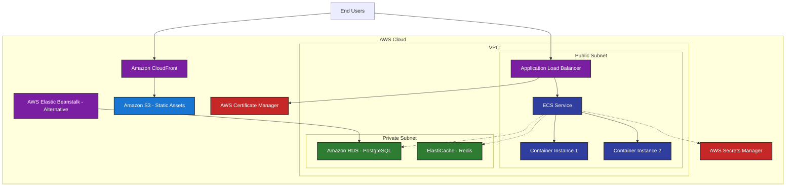

# ClinicEase AI - AWS Architecture Diagram

## Component Descriptions

### Core Components

1. **Application Load Balancer (ALB)**
   - Distributes incoming traffic across multiple container instances
   - Provides SSL termination with certificates from ACM
   - Health checks for automatic failover

2. **ECS (Elastic Container Service)**
   - Container orchestration service for running the application
   - Manages container instances and scaling
   - Integrates with ALB for traffic distribution

3. **Container Instances**
   - Docker containers running the Next.js application
   - Serve both frontend and API routes
   - Handle real-time communication via Socket.io

4. **Amazon RDS (PostgreSQL)**
   - Managed PostgreSQL database service
   - Handles all application data storage
   - Provides automated backups and failover

5. **ElastiCache (Redis)**
   - In-memory data store for caching
   - Session storage for improved performance
   - Real-time data synchronization

### Supporting Services

6. **Amazon S3**
   - Object storage for static assets
   - Profile images and document storage
   - Backup storage for critical data

7. **Amazon CloudFront**
   - Content delivery network
   - Global distribution of static assets
   - Improved performance and reduced latency

8. **AWS Certificate Manager (ACM)**
   - SSL/TLS certificate management
   - Automatic renewal of certificates
   - Integration with ALB and CloudFront

9. **AWS Secrets Manager**
   - Secure storage of environment variables
   - Automatic rotation of secrets
   - Integration with ECS task definitions

### Alternative Deployment

10. **AWS Elastic Beanstalk**
    - Simplified deployment option
    - Managed application hosting
    - Automatic scaling and monitoring

## Data Flow

1. **User Request** → CloudFront/S3 (static assets) or ALB (application)
2. **ALB** → ECS Container Instances (load balanced)
3. **Container** ↔ RDS (database operations)
4. **Container** ↔ ElastiCache (caching/session storage)
5. **Container** → S3 (file uploads/downloads)
6. **Container** ↔ Secrets Manager (environment variables)

## Security Boundaries

- **Public Subnet**: Contains internet-facing components (ALB)
- **Private Subnet**: Contains sensitive components (RDS, ElastiCache)
- **VPC**: Network isolation for all components
- **Security Groups**: Control traffic between components

## High Availability

- **Multi-AZ Deployment**: RDS and ECS across multiple availability zones
- **Auto Scaling**: ECS automatically adjusts container count based on demand
- **Load Balancing**: ALB distributes traffic for fault tolerance
- **Backup and Recovery**: Automated backups for RDS

## Monitoring and Logging

- **CloudWatch**: Metrics and logs for all AWS services
- **Health Checks**: ALB monitors container health
- **Alerting**: Notifications for critical events